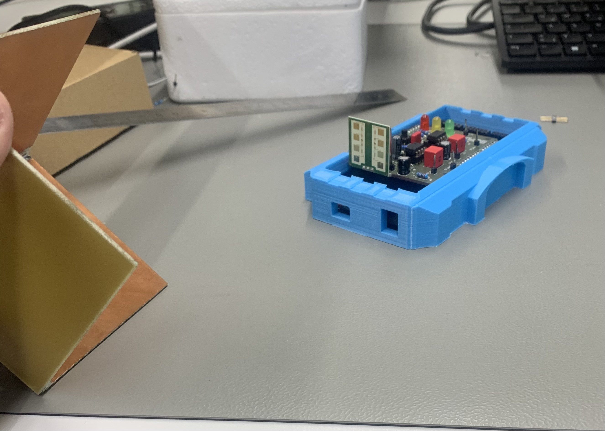
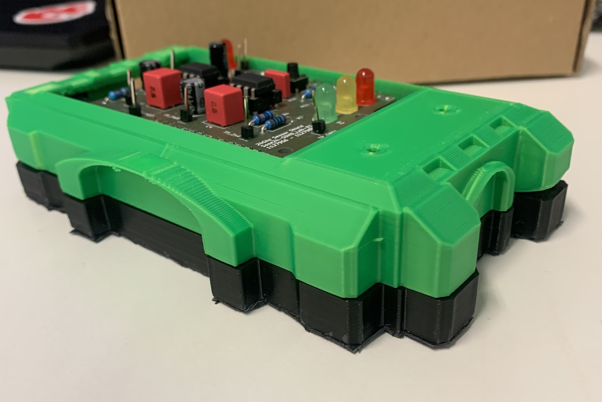
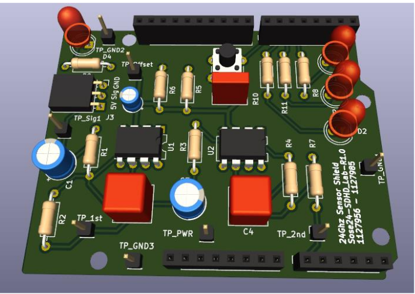
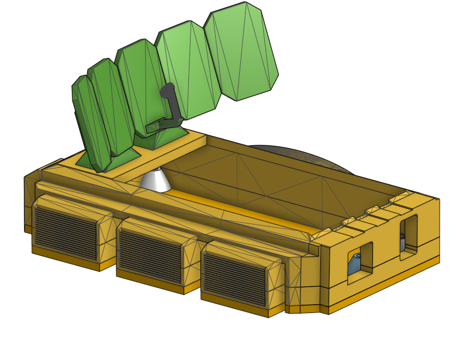
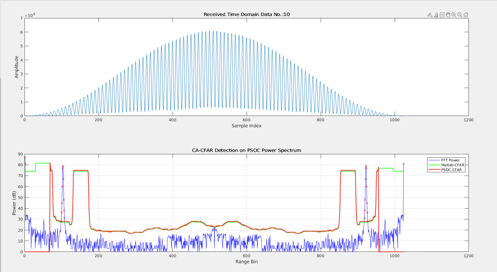

# Movement-Detection-using-24Ghz-Radar
Adaptive movement detection using 24Ghz Radar and CFAR Algorithm

# Radar Movement Detection System

  
    

## Project Overview
This project implemented a radar-based movement detection system using  IPM165 radar sensor, FreeSoc2 Development Board, along with CA-CFAR algorithm. The system included custom PCB design, radar signal processing, and 3D-printed enclosure.

## Features
- 4-layer PCB design integrating IPM165 radar sensor
- Two-stage bandpass filter with gain of 300
- DMA streaming from ADC to Memory
- Signal processing using Hanning window and FFT
- Movement detection using CA-CFAR algorithm
- Custom 3D-printed enclosure

## Hardware
### PCB Design
- 4-layer PCB designed in Kicad
- Integrates IPM165 radar sensor
- Includes two-stage bandpass filter (Gain = 300)

### Enclosure
- Custom 3D-printed designed in Onshape

## Software
### Firmware (C)
- DMA streaming from ADC
- Hanning window application
- FFT implementation
- CA-CFAR algorithm for movement detection

### MATLAB
- Verification script for signal processing algorithms

## Results and Performance

